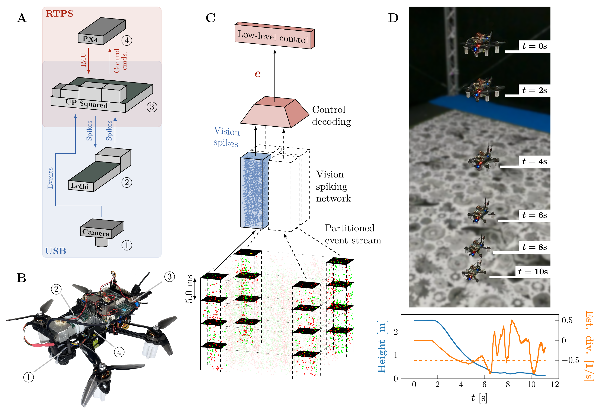

# Fully neuromorphic vision and control for autonomous drone flight

Work published in Science Robotics \[[project page](https://mavlab.tudelft.nl/fully_neuromorphic_drone)\]. If you use this code, please cite our work:

```bibtex
@article{paredesvalles2024fully,
  author = {F. Paredes-Vallés  and J. J. Hagenaars  and J. Dupeyroux  and S. Stroobants  and Y. Xu  and G. C. H. E. de Croon},
  title = {Fully neuromorphic vision and control for autonomous drone flight},
  journal = {Science Robotics},
  volume = {9},
  number = {90},
  pages = {eadi0591},
  year = {2024},
  doi = {10.1126/scirobotics.adi0591}
}
```

This code allows for the training of the 'vision spiking network' as shown in part C of the figure below.



## Training

The raw dataset from the article can be downloaded from [here](https://doi.org/10.34894/QTFHQX). We have a processed version of it [here](https://surfdrive.surf.nl/files/index.php/s/AKTNpOvQ5mUTjSd). By default, this dataset is expected at `data/datasets/`.

To train a model defined in one of the `configs/*.yaml` files, run:

```bash
python train.py --config configs/<config-of-choice>.yaml
```

You can track the training progress with MLflow:

```bash
mlflow ui
```

and accessing http://127.0.0.1:5000/.

## Inference

To estimate planar optical flow from the test sequences from our dataset and compare against ground-truth data, run:

```bash
python eval_flow.py <model_runid>
```

where `<model_runid>` is the ID of the run to be evaluated (check MLflow).
